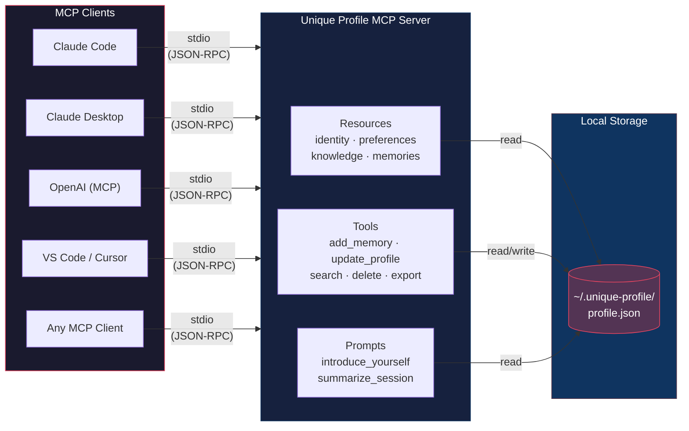

# Unique Profile

A portable, self-hostable **personal AI profile** MCP server. Carry your identity, preferences, and memories across any MCP-compatible LLM — Claude, GPT, Grok, and more.

## Why

Every AI provider has its own memory feature, but they're all siloed. Switch from Claude to ChatGPT? Start from scratch. Unique Profile solves this: **you own your profile, you bring it anywhere.**

## Architecture



**One profile. Any model. Your machine.**

Each MCP client spawns the server as a subprocess and communicates over stdio. All clients read from and write to the same local JSON file — so a memory saved by Claude is available to GPT, and vice versa.

## Quick Start

### 1. Install

```bash
cd unique-profile
pip install -e .
```

### 2. Configure your MCP client

Open your Claude Code settings file (`~/.claude/settings.json`) and add the server under `mcpServers`. If the file doesn't exist or doesn't have an `mcpServers` key, create it.

**Option A — Using the installed console script:**

```json
{
  "mcpServers": {
    "unique-profile": {
      "command": "unique-profile",
      "env": {
        "UNIQUE_PROFILE_DIR": "/path/to/your/profile/data"
      }
    }
  }
}
```

**Option B — Using the venv Python directly (useful if the console script isn't on your PATH):**

```json
{
  "mcpServers": {
    "unique-profile": {
      "command": "/path/to/unique-profile/.venv/Scripts/python.exe",
      "args": ["-m", "unique_profile.server"]
    }
  }
}
```

If you omit `UNIQUE_PROFILE_DIR`, data is stored in `~/.unique-profile/`.

### 3. Verify it's working

> **TL;DR** — Restart session → `/mcp` → ask a question only your profile can answer.

- **Restart your session.** Exit Claude Code (`/quit` or Ctrl+C) and re-run `claude`. The MCP server spawns automatically on startup.

- **Check MCP status.** Run `/mcp` inside Claude Code. You should see `unique-profile` listed as **connected** with 6 tools available.

- **Troubleshooting** — if it shows disconnected or missing:
  - Verify the `command` path in your settings is correct
  - Confirm the venv has `mcp` installed (`pip install mcp`)
  - Run the server manually to see errors:
    ```bash
    unique-profile
    # or
    /path/to/.venv/Scripts/python.exe -m unique_profile.server
    ```

- **Smoke test with real queries.** Try these — each one exercises a different MCP primitive:

  > *"What languages do I speak?"*
  > Tests **resource reading**. The LLM has no way to answer this without the profile. If it lists your languages, the server is injecting context correctly.

  > *"Export my profile as JSON"*
  > Tests the **`export_profile`** tool. Should return your full profile data.

  > *"Search my memories for python"*
  > Tests **`search_memories`**. Returns any memories matching the keyword.

  > *"Add a memory that I prefer dark mode"*
  > Tests **`add_memory`**. Should confirm a new entry with a `mem_` ID and timestamp.

  > *"Confirm memory mem_XXXX"* (use a real ID from the search above)
  > Tests **`confirm_memory`**. Changes confidence from `auto_inferred` to `user_confirmed`.

  > *"Delete memory mem_XXXX"* (use a real ID)
  > Tests **`delete_memory`**. Removes the entry and confirms deletion.

  > *"Introduce yourself as if you know me"*
  > Tests the **`introduce_yourself`** prompt. The LLM should generate a personalized greeting using your profile data.

- **Success criteria:** If these queries return meaningful data from your profile, the full pipeline is working: client → stdio/JSON-RPC → server → `profile.json` → response.

### 4. Use it

Once connected, the LLM can:

- **Read your profile** via resources (`profile://identity`, `profile://preferences`, etc.)
- **Update your profile** via tools (`update_profile`, `add_memory`, `search_memories`)
- **Generate introductions** via the `introduce_yourself` prompt template

## What's in the Profile

| Section | Contents |
|---------|----------|
| **Identity** | Name, background, profession, location, languages |
| **Preferences** | Communication style, explanation depth, formality, humor |
| **Knowledge** | Skills, interests, ongoing projects |
| **Memories** | Timestamped entries with tags, source model, and confidence level |

Every memory tracks **provenance** — which model created it, when, and whether you confirmed it.

## MCP Primitives

### Resources
- `profile://identity` — Core bio
- `profile://preferences` — Communication preferences
- `profile://knowledge` — Skills, interests, projects
- `profile://memories` — Stored memories (most recent 50)

### Tools
- `update_profile(section, key, value)` — Update a profile field
- `add_memory(content, tags, source_model)` — Store a new memory
- `search_memories(query)` — Search memories by keyword
- `delete_memory(memory_id)` — Remove a memory
- `confirm_memory(memory_id)` — Mark a memory as user-confirmed
- `export_profile(fmt)` — Export as JSON or markdown

### Prompts

#### `introduce_yourself`

Generates a system prompt from the current profile state. Reads identity, preferences, knowledge, and recent memories, then concatenates them into a structured block that can be prepended to any conversation.

**What it produces:**
- Identity fields (name, profession, location, languages) — only included if non-empty
- Communication preferences (style, depth, formality, humor)
- Skills and interests as comma-separated lists
- Ongoing projects as bullet points
- Last 5 memories with date prefix and truncated content (150 chars)

**Known limitations:**
- No token budget awareness — output grows with profile size
- No priority weighting between confirmed and auto-inferred memories
- Flat rendering — no grouping or summarization of related items

#### `summarize_session`

Returns an instruction prompt that asks the LLM to summarize the current conversation for storage as a memory. Accepts an optional `conversation_notes` parameter.

**Focus areas requested:**
- New facts learned about the user
- Decisions made or preferences expressed
- Project progress or status updates
- Action items or next steps

**Known limitations:**
- No schema enforcement on output — relies on the LLM to produce bullet points
- No integration with `add_memory` — the caller must save the summary separately
- No deduplication — doesn't check for existing similar memories before saving

## Data Storage

Profile data is stored as a single JSON file at `~/.unique-profile/profile.json` (or your custom path). No database, no cloud — just a file you control.

## License

MIT
