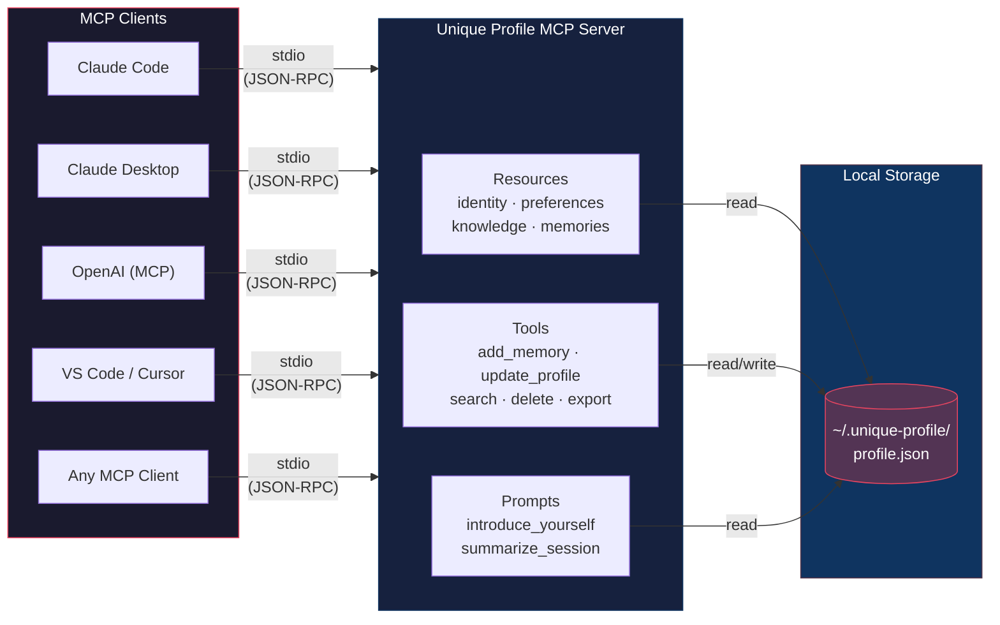

# Unique Profile

A portable, self-hostable **personal AI profile** MCP server. Carry your identity, preferences, and memories across any MCP-compatible LLM — Claude, GPT, Grok, and more.

## Why

Every AI provider has its own memory feature, but they're all siloed. Switch from Claude to ChatGPT? Start from scratch. Unique Profile solves this: **you own your profile, you bring it anywhere.**

## Architecture



**One profile. Any model. Your machine.**

Each MCP client spawns the server as a subprocess and communicates over stdio. All clients read from and write to the same local JSON file — so a memory saved by Claude is available to GPT, and vice versa.

## Quick Start

### 1. Install

```bash
cd unique-profile
pip install -e .
```

### 2. Configure with Claude Code

Add to your Claude Code MCP settings (`~/.claude/settings.json` or project `.mcp.json`):

```json
{
  "mcpServers": {
    "unique-profile": {
      "command": "unique-profile",
      "env": {
        "UNIQUE_PROFILE_DIR": "/path/to/your/profile/data"
      }
    }
  }
}
```

If you omit `UNIQUE_PROFILE_DIR`, data is stored in `~/.unique-profile/`.

### 3. Use it

Once connected, the LLM can:

- **Read your profile** via resources (`profile://identity`, `profile://preferences`, etc.)
- **Update your profile** via tools (`update_profile`, `add_memory`, `search_memories`)
- **Generate introductions** via the `introduce_yourself` prompt template

## What's in the Profile

| Section | Contents |
|---------|----------|
| **Identity** | Name, background, profession, location, languages |
| **Preferences** | Communication style, explanation depth, formality, humor |
| **Knowledge** | Skills, interests, ongoing projects |
| **Memories** | Timestamped entries with tags, source model, and confidence level |

Every memory tracks **provenance** — which model created it, when, and whether you confirmed it.

## MCP Primitives

### Resources
- `profile://identity` — Core bio
- `profile://preferences` — Communication preferences
- `profile://knowledge` — Skills, interests, projects
- `profile://memories` — Stored memories (most recent 50)

### Tools
- `update_profile(section, key, value)` — Update a profile field
- `add_memory(content, tags, source_model)` — Store a new memory
- `search_memories(query)` — Search memories by keyword
- `delete_memory(memory_id)` — Remove a memory
- `confirm_memory(memory_id)` — Mark a memory as user-confirmed
- `export_profile(fmt)` — Export as JSON or markdown

### Prompts
- `introduce_yourself` — Generate a system prompt from the current profile
- `summarize_session` — Summarize a conversation for saving as a memory

## Data Storage

Profile data is stored as a single JSON file at `~/.unique-profile/profile.json` (or your custom path). No database, no cloud — just a file you control.

## License

MIT
