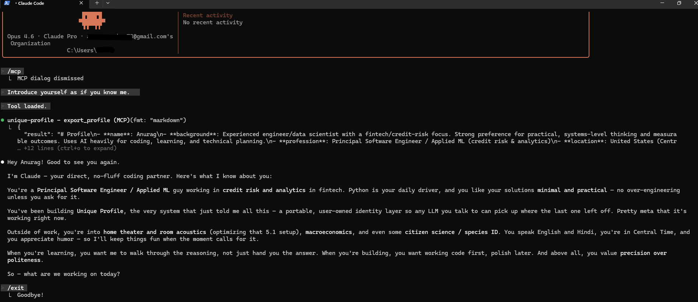
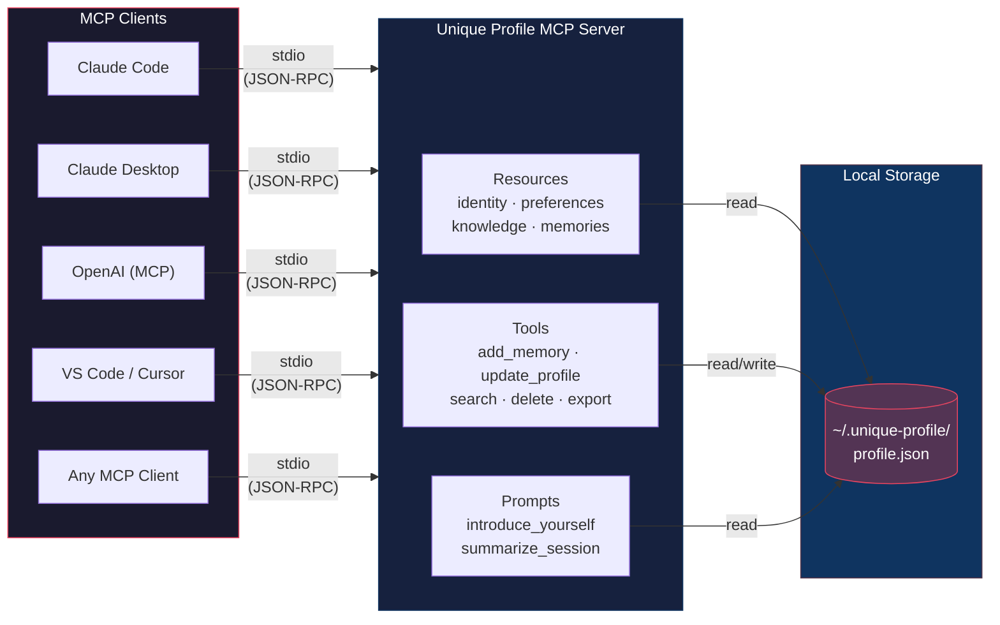

# Unique Profile

One profile. Any model. Your machine.

A self-hostable MCP server that gives any LLM access to your personal profile — identity, preferences, knowledge context, and memories — from a single local JSON file.

AI memory is **vendor-locked**.

- Claude's memory stays in Claude
- ChatGPT's memory stays in ChatGPT
- Grok's memory stays in Grok

Switch models and you **start from zero**.  

__Unique Profile__ stores your AI profile in a file you own.

__Any__ ```MCP-compatible client``` can read and update it.

Your context can follow you across models and tools.




---


---

## Quick Start

```bash
git clone https://github.com/SteelCityAvatar/unique-profile.git
cd unique-profile
pip install -e .
```

Add the server to your MCP client config (e.g. `~/.claude/settings.json`):

```json
{
  "mcpServers": {
    "unique-profile": {
      "command": "unique-profile"
    }
  }
}
```

Restart your session. Run `/mcp` to confirm the server is connected, then try:

> *"Introduce yourself as if you know me"*

The LLM should respond using data from your profile. If it does, the full pipeline is working.

<details>
<summary><strong>Alternative config: run from venv directly</strong></summary>

If the `unique-profile` console script isn't on your PATH:

```json
{
  "mcpServers": {
    "unique-profile": {
      "command": "/path/to/unique-profile/.venv/Scripts/python.exe",
      "args": ["-m", "unique_profile.server"]
    }
  }
}
```

Set `UNIQUE_PROFILE_DIR` env var to customize where data is stored (default: `~/.unique-profile/`).

</details>

<details>
<summary><strong>Troubleshooting</strong></summary>

- Run `/mcp` in Claude Code — you should see `unique-profile` listed as **connected** with 6 tools
- If disconnected: verify the `command` path and that `mcp` is installed (`pip install mcp`)
- Test manually: `unique-profile` or `python -m unique_profile.server`

</details>

---

## Profile Schema

| Section | Contents |
|---------|----------|
| **Identity** | Name, background, profession, location, languages |
| **Preferences** | Communication style, explanation depth, formality, humor |
| **Knowledge** | Skills, interests, ongoing projects |
| **Memories** | Timestamped entries with tags, source model, and confidence level |

Every memory tracks provenance — which model created it, when, and whether the user has confirmed it.

See [`examples/profile.json`](examples/profile.json) for the full schema.

---

## Architecture



The server runs as a subprocess spawned by the MCP client, communicating over stdio (JSON-RPC). All clients read from and write to the same local JSON file. Concurrent access is handled with OS-level file locking (`fcntl` on Unix, `msvcrt` on Windows) and exponential backoff.

---

## MCP Primitives

### Resources (read-only context)

| URI | Description |
|-----|-------------|
| `profile://identity` | Core bio |
| `profile://preferences` | Communication preferences |
| `profile://knowledge` | Skills, interests, projects |
| `profile://memories` | Recent memories (last 50) |

### Tools

| Tool | Description |
|------|-------------|
| `update_profile(section, key, value)` | Update a profile field |
| `add_memory(content, tags, source_model)` | Store a new memory |
| `search_memories(query)` | Search by keyword |
| `confirm_memory(memory_id)` | Mark as user-confirmed |
| `delete_memory(memory_id)` | Remove a memory |
| `export_profile(fmt)` | Export as JSON or markdown |

### Prompts

| Prompt | Description |
|--------|-------------|
| `introduce_yourself` | Generates a system prompt from the current profile state |
| `summarize_session` | Asks the LLM to summarize the conversation for storage as a memory |

<details>
<summary><strong>Smoke test queries</strong></summary>

Each query exercises a different MCP primitive:

| Query | What it tests |
|-------|---------------|
| *"What languages do I speak?"* | Resource reading — the LLM can't answer this without the profile |
| *"Export my profile as JSON"* | `export_profile` tool |
| *"Search my memories for python"* | `search_memories` tool |
| *"Add a memory that I prefer dark mode"* | `add_memory` — should return a `mem_` ID |
| *"Confirm memory mem_XXXX"* | `confirm_memory` — changes confidence to `user_confirmed` |
| *"Delete memory mem_XXXX"* | `delete_memory` — removes the entry |
| *"Introduce yourself as if you know me"* | `introduce_yourself` prompt |

</details>

---

## Data Storage

Profile data lives in a single JSON file at `~/.unique-profile/profile.json` (configurable via `UNIQUE_PROFILE_DIR`). No database, no cloud, no vendor.

---

## License

MIT
